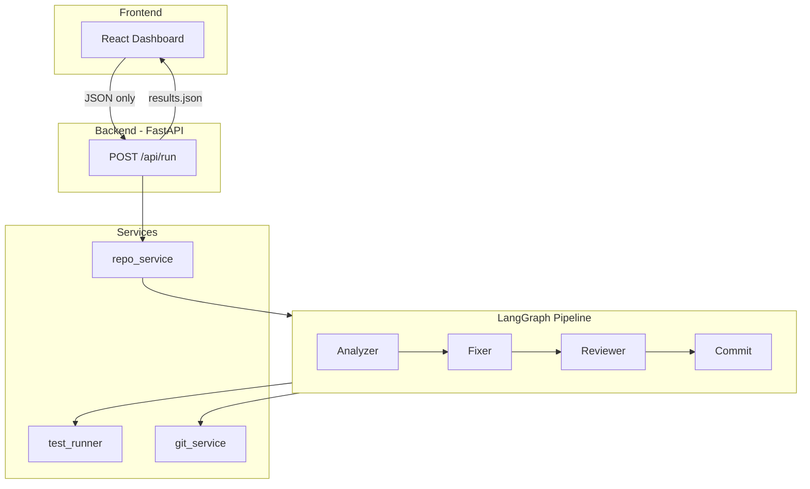

# CI/CD Healing Agent

Autonomous CI/CD healing agent that clones repos, runs pytest, detects failures, applies rule-based fixes, and pushes commits. Built for hackathon demos. No LLM or API key required at runtime.

## Supported Scope

- **Language**: Python only
- **Test framework**: pytest only
- **Repos**: Public GitHub repos
- **Fix scope**: Simple deterministic bugs only
- **Bug types** (hardcoded):
  - `LINTING` (unused import)
  - `SYNTAX` (SyntaxError, missing `:`)
  - `INDENTATION` (IndentationError)
  - `IMPORT` (ModuleNotFoundError)
  - `LOGIC` (AssertionError)
  - `TYPE_ERROR` (TypeError)

## Architecture



**Flow**: Clone → Create branch → Analyzer (run pytest, parse failures) → Fixer (rule-based fixes) → Reviewer (format) → Commit (per-fix commit + push) → Return results.json

## Quick Start

### Backend

```bash
cd backend
pip install -r requirements.txt
uvicorn app.main:app --host 0.0.0.0 --port 8000
```

**Start from `backend/`:** Run `cd backend && uvicorn app.main:app --host 0.0.0.0 --port 8000`. You can also run from project root (`uvicorn app.main:app ...`); `.env` is loaded from `backend/.env` regardless of cwd.

**Verify config:** Open `http://localhost:8000/api/check` — confirm `llm_required: false` (no API key needed).

### Frontend

```bash
cd frontend
npm install
npm run dev
```

Open http://localhost:5173

### Docker (Backend)

```bash
cd backend
docker build -t cicd-healing-agent .
docker run -p 8000:8000 cicd-healing-agent
```

## Live URL & Demo

- **Backend**: `http://localhost:8000` (local)
- **Frontend**: `http://localhost:5173` (local)
- **API docs**: `http://localhost:8000/docs`
- **Demo link**: Use a known failing Python repo; see [DEMO.md](DEMO.md) for demo safety rules.

## Deployment

### Frontend (Vercel)

```bash
cd frontend
# Set VITE_API_URL to your backend URL in Vercel project settings
vercel deploy
```

### Backend (Railway, Render, Fly.io)

Deploy the `backend/` directory. Set env vars: `GITHUB_TOKEN` (for push), `RETRY_LIMIT` (default 5).

### GITHUB_TOKEN (for push)

To push fixes to GitHub, add `GITHUB_TOKEN` to `backend/.env` or your deployment env. Create a Personal Access Token at https://github.com/settings/tokens with `repo` scope.

## Future Work

- **Docker Compose**: Single command to run backend + frontend
- **CI polling**: Poll GitHub Actions / external CI instead of running pytest locally
- **More bug types**: Extend pattern mappings

## Project Structure

```
ai-agent/
├── backend/
│   ├── app/
│   │   ├── api/run.py       # POST /api/run
│   │   ├── agent/           # LangGraph: analyzer, fixer, reviewer, commit
│   │   ├── services/         # repo, test_runner, git
│   │   └── utils/           # result_builder
│   ├── requirements.txt
│   └── Dockerfile
├── frontend/
│   └── src/                 # React dashboard (5 sections)
├── DEMO.md                  # Demo safety rules
└── README.md
```

## License

MIT
