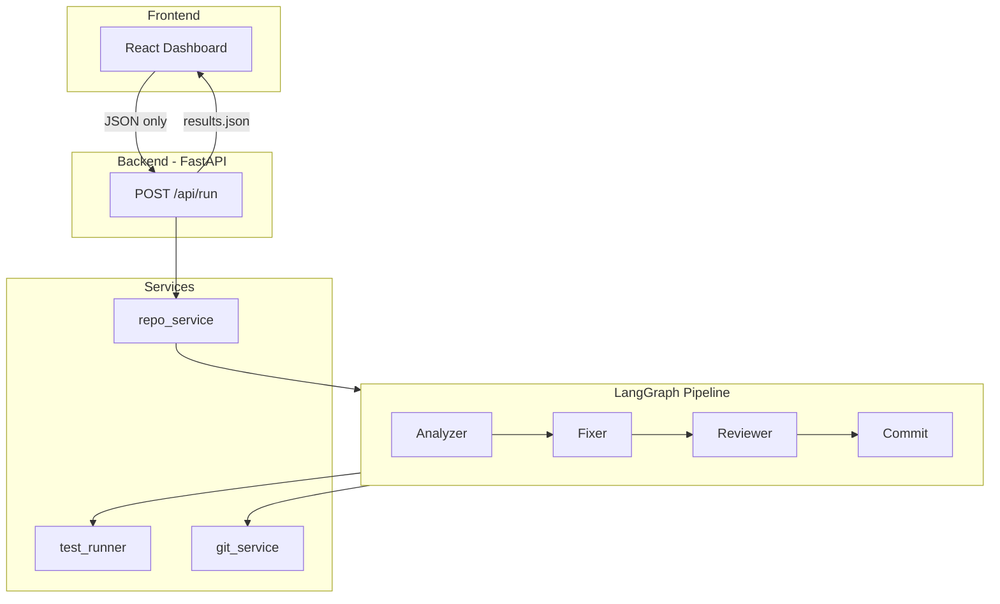

# CI/CD Healing Agent

Autonomous CI/CD healing agent that clones repos, runs pytest, detects failures, applies rule-based fixes, and pushes commits. Built for hackathon demos. No LLM or API key required at runtime.

## Supported Scope

- **Language**: Python only
- **Test framework**: pytest only
- **Repos**: Public GitHub repos
- **Fix scope**: Simple deterministic bugs only
- **Bug types** (hardcoded):
  - `LINTING` (unused import)
  - `SYNTAX` (SyntaxError, missing `:`)
  - `INDENTATION` (IndentationError)
  - `IMPORT` (ModuleNotFoundError)
  - `LOGIC` (AssertionError)
  - `TYPE_ERROR` (TypeError)

## Architecture



**Flow**: Clone → Create branch → Analyzer (run pytest, parse failures) → Fixer (rule-based fixes) → Reviewer (format) → Commit (per-fix commit + push) → Return results.json

## Quick Start

### Setup Checklist (Local)

- **Python 3.11+**, **Node 18+**
- `pip install -r backend/requirements.txt` (includes pytest)
- Create `backend/.env` with `GITHUB_TOKEN=ghp_...` — create a token at [GitHub Settings > Tokens](https://github.com/settings/tokens) with `repo` scope
- Start backend: `cd backend && uvicorn app.main:app --host 0.0.0.0 --port 8000`
- Start frontend: `cd frontend && npm install && npm run dev`
- Open http://localhost:5173

### Backend

```bash
cd backend
pip install -r requirements.txt
uvicorn app.main:app --host 0.0.0.0 --port 8000
```

**Start from `backend/`:** Run `cd backend && uvicorn app.main:app --host 0.0.0.0 --port 8000`. You can also run from project root (`uvicorn app.main:app ...`); `.env` is loaded from `backend/.env` regardless of cwd.

**Verify config:** Open `http://localhost:8000/api/check` — confirm `llm_required: false` (no API key needed).

### Frontend

```bash
cd frontend
npm install
npm run dev
```

Open http://localhost:5173

### Docker (Backend)

```bash
cd backend
docker build -t cicd-healing-agent .
docker run -p 8000:8000 cicd-healing-agent
```

## Live URL & Demo

- **Backend**: `http://localhost:8000` (local)
- **Frontend**: `http://localhost:5173` (local)
- **API docs**: `http://localhost:8000/docs`
- **Demo link**: Use a known failing Python repo; see [DEMO.md](DEMO.md) for demo safety rules.

## Deployment

### Frontend (Vercel)

```bash
cd frontend
# Set VITE_API_URL to your backend URL in Vercel project settings
vercel deploy
```

### Backend (Railway, Render, Fly.io)

Deploy the `backend/` directory. Set env vars:

- `GITHUB_TOKEN` — fallback for push (optional)
- `GITHUB_CLIENT_ID`, `GITHUB_CLIENT_SECRET`, `BACKEND_URL`, `FRONTEND_URL` — for OAuth (Sign in with GitHub)
- `RETRY_LIMIT` (default 5)

### Push (GitHub auth)

Two options for push access:

**1. Sign in with GitHub (OAuth)** — Recommended for deployed use. Users click "Sign in with GitHub" and authorize; no token needed. Set:

- `GITHUB_CLIENT_ID`, `GITHUB_CLIENT_SECRET` — from [GitHub OAuth App](https://github.com/settings/developers)
- `BACKEND_URL` — backend URL (e.g. `https://backend.onrender.com`)
- `FRONTEND_URL` — frontend URL (e.g. `https://aiagent-blush.vercel.app`)

In the GitHub OAuth App, set **Authorization callback URL** to `{BACKEND_URL}/auth/callback`.

**2. GITHUB_TOKEN** — Fallback for deployer's repos or local use. Set in `backend/.env` or deployment env. Create at [GitHub Settings > Tokens](https://github.com/settings/tokens) with `repo` scope.

## Future Work

- **Docker Compose**: Single command to run backend + frontend
- **CI polling**: Poll GitHub Actions / external CI instead of running pytest locally
- **More bug types**: Extend pattern mappings

## Project Structure

```
ai-agent/
├── backend/
│   ├── app/
│   │   ├── api/run.py       # POST /api/run
│   │   ├── api/auth.py      # OAuth: /auth/login, /auth/callback
│   │   ├── agent/           # LangGraph: analyzer, fixer, reviewer, commit
│   │   ├── services/         # repo, test_runner, git
│   │   └── utils/           # result_builder
│   ├── requirements.txt
│   └── Dockerfile
├── frontend/
│   └── src/                 # React dashboard (5 sections)
├── DEMO.md                  # Demo safety rules
└── README.md
```

## License

MIT
